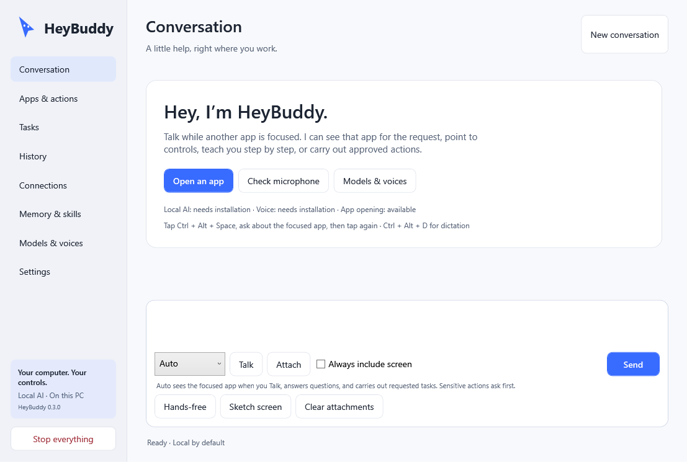
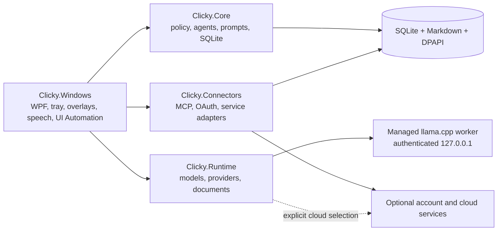

# HeyBuddy

HeyBuddy is a local-first Windows desktop assistant for conversation, dictation, screen guidance, documents, and permission-controlled computer tasks. It is built with C#/.NET 10 and WPF, runs as a normal tray application, and can use an app-managed local language model without Docker or a terminal.

`Windows 11 x64` · `.NET 10` · `WPF` · `Local AI` · `English / Persian / Turkish`

HeyClicky 1.0.48 is the feature reference. HeyBuddy is an independent Windows implementation based on observed behavior and the older [MIT-licensed Clicky repository](https://github.com/farzaa/clicky); it does not contain the Mac application or its private services.

> **Current release: 0.3.0.** Talk can temporarily see the app that was focused when recording began, answer questions about it, point to matching controls, and present click-progressed walkthroughs. Auto can use fresh accessibility IDs to invoke a verified control and shows a separate action marker; guidance itself still cannot click. Local AI, speech, documents, history, and selected Windows actions work; installed and fixture evidence are labeled separately. Authenticated account connectors and the broader cross-application matrix remain open. See [what has actually been validated](docs/validation.md).

## Screenshot



This is a sanitized diagnostic render of the real WPF interface. It is layout evidence rather than proof of an authenticated account or external action.

## Install

The release process creates two files under `artifacts/release/`:

- `HeyBuddy-0.3.0-Setup-x64.exe` — per-user Windows installer.
- `HeyBuddy-0.3.0-win-x64.zip` — portable, self-contained application.

`artifacts/` is intentionally excluded from Git. Publish those two files with `SHA256SUMS.txt` on the matching GitHub Release rather than committing binaries. Exact outer-package hashes are kept in that release asset and are not duplicated inside packaged documentation, since changing a packaged document changes the package hashes.

The installer needs no administrator account and places the application under `%LOCALAPPDATA%\Programs\HeyBuddy`. The portable build runs from its extracted `HeyBuddy` folder. Both include the .NET desktop runtime; model weights and voice assets are downloaded separately from **Models & voices**. The build is currently unsigned, so a checksum proves file integrity but not publisher identity.

Personal data remains separate from the executable:

| Content | Default location |
|---|---|
| Settings, history, memory, skills, credentials, workspace | `%LOCALAPPDATA%\ClickyLocal` |
| Local model weights | User-selected `<model-folder>` |
| App-managed inference and speech runtimes | `%LOCALAPPDATA%\ClickyLocal\Runtime` |

The internal `ClickyLocal` path and `Clicky.*` namespaces are retained so existing data continues to work after the HeyBuddy rename. Read the [install, upgrade, backup, and recovery guide](docs/recovery.md) before changing versions.

## First run

1. Open **Models & voices** and install or verify local AI, Whisper, and the voices you want.
2. Open **Conversation**. **Auto** is the default: it can answer or use enabled tools. Sensitive actions show a concrete preview first.
3. Focus an app and use **Talk** to ask what is visible, where a control is, or how to complete a workflow. Typed “where is…” and “show me how…” questions also include the remembered focused app by default. Screens and documents stay local unless you explicitly allow them for a selected cloud provider.
4. Open **Apps & actions** to find registered Windows applications. Exact requests such as `Open Calculator`, `تلگرام را باز کن`, or `Telegram aç` can use the local action path without waiting for the AI model.
5. Press `Ctrl+Alt+Escape` or choose **Stop everything** to cancel recording, speech, inference, queued actions, and active automation.

Closing the main window leaves HeyBuddy in the tray. Choose **Quit** from the tray menu to stop its managed workers and exit.

## Capability status

| Area | Status | Current behavior and boundary |
|---|---|---|
| Conversation and history | **Working locally** | Streaming typed chat, selectable replies, SQLite history, cancellation, and English/Persian/Turkish text. Local model quality still depends on the selected model. |
| Local AI and vision | **Working locally** | Pinned Qwen 3.5 4B, authenticated loopback llama.cpp worker, resource controls, model verification, crash recovery, and optional startup preload. Screen analysis is faster at reduced image size; small text may require a selected region. |
| Local speech | **Working; one live device probe completed** | Whisper transcription, Piper replies, device selection, previews, speed control, interruption, quiet-signal handling, generated EN/FA/TR tests, and an eight-second capture through the selected USB input. Broad human accuracy testing remains; Persian recognition has meaningful word errors. |
| Dictation | **Working in guarded fixtures** | Frozen target, streaming preview, cleanup, dictionary, cancellation, clipboard preservation, and transcript recovery. The full Notepad/Chromium/VS Code/Office matrix is incomplete. |
| Screen guidance | **Working with limits** | Talk-time focused-window capture, typed screen-intent detection in EN/FA/TR, aligned accessibility coordinates, scribbles, color-matched pointers, and click-progressed walkthrough steps with optional spoken narration. Guidance cannot execute clicks. Protected/GPU-only surfaces, mixed-DPI interaction, and broad application walkthrough coverage remain incomplete. |
| Files and documents | **Working locally** | Import and bounded extraction for text, PDF, DOCX, XLSX, and PPTX; generation for text, Office formats, and PDF. Scanned PDFs need OCR. Legacy `.doc`, `.xls`, and `.ppt` must be converted first. |
| Memory and skills | **Working locally** | Editable Markdown profile and skills with path confinement, backups, and SQLite-backed history. No unsupervised memory extraction. |
| Agents | **Working with approval controls** | Durable task cards, progress, retry, follow-up, cancellation, tool discovery, 30-action/10-minute bounds, and at most two retries per failed action. A task cannot complete from prose alone when an action was required. |
| Installed applications | **Partially live-verified** | Registered app discovery, exact IDs, ambiguity handling, existing-window activation, and protected/elevated target refusal. Calculator and Telegram activation were observed after installation; arbitrary executables, arguments, shell commands, and URLs are rejected. |
| Connectors | **Implemented; account setup required** | MCP HTTP/stdio, OAuth/PKCE, refresh, scope display, tool toggles, revocation, Google adapters, Spotify, public research, and local bridges. Development did not authorize owner accounts or claim account writes. |
| Cloud AI | **Optional and unverified with an owner key** | OpenAI-compatible, OpenAI, Anthropic, and request-scoped OpenAI Realtime adapters. HeyBuddy never selects a paid provider automatically. |
| macOS-only services | **Unsupported on Windows** | Native iMessage, Find My, and macOS automation are listed as compatibility limits rather than Windows features. |

Office documents can be read or generated without Microsoft Office. Operating Word, Excel, or PowerPoint requires the real applications to be installed and their controls to be accessible; none were registered on the validation PC.

## Conversation modes

| Mode | Purpose |
|---|---|
| **Auto** | Default conversation for questions and tasks. It can call enabled tools and records progress and actions. |
| **Agent** | A bounded task that continues in the background and requires real action evidence when work was requested. |
| **Chat only** | Conversation and visual guidance without tool execution. |
| **Dictate** | Speech-to-text insertion into the application that was focused when dictation began. |

## Controls and customization

Default shortcuts are configurable:

| Action | Default |
|---|---|
| Talk: tap once to listen and again to send, or hold and release | `Ctrl+Alt+Space` |
| Dictate into the focused application | `Ctrl+Alt+D` |
| Open the agent composer | `Ctrl+Alt+A` |
| Emergency stop | `Ctrl+Alt+Escape` |

In **Settings → Keyboard shortcuts**, click any action field, press the preferred button or combination, then release it. Valid changes save immediately. Single letters, numbers, function keys, Space, Enter, navigation keys, punctuation, Left Shift, Right Shift, Left Ctrl, Right Ctrl, Left Alt, and Right Alt are supported. Escape alone cancels recording and Tab alone keeps keyboard navigation; add a modifier if you want to use either. Mouse, synthetic, duplicate, and reserved Windows shortcuts are rejected.

A one-button shortcut is global while HeyBuddy runs. If you assign `A`, `Space`, Left Shift, or another ordinary button, HeyBuddy captures it for that action and it will not work normally in other applications. If one action uses Shift, Ctrl, or Alt alone, another action cannot use that same modifier in its combination because both actions would start together. Function keys or non-overlapping combinations are better defaults when you still need the button's usual behavior.

In **Settings → Screen and companion**, Talk-time screen context, typed screen-aware questions, and visual guidance are individually configurable. Open **Choose from color palette…** for the full Windows color picker with Red, Green, and Blue fields, or enter an exact hex value. The chosen color is also used by pointers and the separate action marker. Cancel preserves the current color; confirming applies and saves it. While voice input is active, the half-size pointer becomes a compact three-bar microphone meter that moves with the real input level. Companion size, reduced motion, screen source, image quality, microphone, output, voice, speed, model paths, GPU limits, retention, and startup behavior are also configurable.

**Hands-free** is explicitly enabled and does not restart itself after relaunch. It uses energy-based voice detection and currently has no acoustic echo cancellation, so headphones are recommended.

## Privacy and action safety

- Local is the default provider. There is no silent cloud or paid fallback.
- Screen, document, and tool-derived content requires explicit cloud-content permission before a cloud adapter receives it.
- Screenshots and microphone PCM are transient by default. Fresh screen observation IDs and injected instructions are removed after the turn and are not saved as the task prompt; bounded tool evidence remains in task history when an action actually runs. Imported files are copied into the approved local workspace deliberately.
- Provider and connector credentials are protected for the signed-in Windows user with DPAPI and are excluded from logs.
- File tools stay inside the configured workspace and reject traversal, reparse points, and alternate data streams.
- UI actions revalidate the target before input and the result afterward. Accessible buttons, toggles, and selections are invoked directly when supported; a verified foreground pointer fallback is used only when required. Ambiguous, changed, protected, elevated, and unsupported targets stop with an error.
- Sending, publishing, deleting, purchasing, business-data changes, and production configuration require a concrete preview and approval.
- Visual guidance is separate from computer input. A pointer, annotation, or walkthrough instruction cannot trigger a click.

## Connections

The catalog covers Google services, Notion, Slack, Linear, Airtable, GitHub, Supabase, Vercel, Spotify, YouTube, maps and public research, Obsidian, Office document tools, Blender, Excalidraw, and installed Codex/Claude MCP bridges. Each connection has its own setup, scopes, credential storage, harmless read test, tool permissions, and revocation path.

The UI distinguishes **implemented**, **configured**, **connected**, and **verified**. A working transport or profile read does not prove every service action. Subscriptions, API quotas, OAuth client registration, installed bridge software, and account permissions remain external requirements. See [connector setup and current limits](docs/connectors.md).

## Architecture



`Clicky.Core` owns policy and persistence. `Clicky.Runtime` owns local/cloud model transports and document processing. `Clicky.Connectors` owns account integrations. `Clicky.Windows` owns the native desktop, capture, input, and speech. Prompts are versioned in source, and computer actions still pass through Core policy regardless of which model or connector suggested them.

## Validation

The latest persisted source checks include:

- Final Release build: zero errors and zero warnings; aggregate automated failures: zero.
- Core: 172/172 tests.
- Runtime: 51/51 tests without paid calls or owner cloud keys.
- Connectors: 12/12 protocol and policy tests, plus 10/10 connector UI checks without owner accounts.
- Conversation routing: 41/41 checks.
- Shortcut, screen, and color controls: 100/100 non-interactive checks, including automatic Talk screen context, typed location intent, guidance/action separation, tap/hold voice transitions, immediate persistence, focused Agent mode, distinct left/right Shift, Ctrl and Alt, AltGr handling, bare letters and digits, navigation, punctuation, duplicate/reserved/overlapping keys, exact-side dispatch, and repeat-key safety. A live physical standalone-modifier flow remains unclaimed.
- Companion rendering: 16/16 checks across 96, 144, and 192 DPI, including compact listening state and input-responsive voice bars.
- Native speech/input: the full owned-window fixture passes, including focused-window coordinate mapping, accessibility button invocation and action marker, password/stale/focus/cancellation refusal, Persian dictation with clipboard restoration, selected audio output, asset hashes, and generated EN/FA/TR speech. A separate eight-second live probe received 99 frames from `Microphone (USB Audio Device)`, measured a quiet −42 dB maximum dynamic level, and produced a local English transcript; broader human accuracy testing remains.
- Local screen guidance: installed Qwen 3.5 4B produced a parsed visual pointer from a sanitized native-window image and accessibility map in 3.8 seconds; the aligner then binds matching labels to exact accessible-control coordinates.
- Installed-app catalog: 18/18 read-only checks.
- Hosted Calculator identity: 26 checks with the already-open app and no input sent by the harness.
- Main-window rendering: 17/17 desktop, compact, app-picker, and Persian RTL checks.
- NuGet vulnerability scan: zero vulnerable package entries across ten projects at the recorded audit time.
- Installed 0.2.1 baseline upgrade: all 537 payload files verified, the app relaunched, and five retained settings, memory, and history files preserved byte-for-byte. Exact outer-package hashes are supplied in that GitHub Release's `SHA256SUMS.txt` asset.

The installed UI displayed 0.2.0 and reached local-model Ready. Exact Auto requests brought existing Calculator and Telegram windows forward with one verified action each; no private Telegram content was read. A separate installed Auto run found `heybuddy-typing-check.txt - Notepad` and showed a `desktop_type` approval preview containing the exact marker `[HEYBUDDY-LIVE-VERIFY-20260903]`. Its first typing attempt failed closed because the control did not expose verifiable editable text. Auto refreshed the snapshot and completed one bounded retry; the five-action run ended with `performed=true`, `targetVerified=true`, `outcomeVerified=true`, and `foregroundChanged=false`. A later independent visual reread was stopped when user input was detected, so it is not claimed as separate evidence. Version 0.2.3 adds the live USB microphone probe described above. Authenticated account connectors, Office application control, physical global shortcut gestures, hands-free acoustics, and mixed-DPI interaction still need broader live validation.

Read the [full validation record](docs/validation.md), [0.2.0 refinement evidence](docs/refinement-2026-09-03.md), and [feature matrix](docs/feature-matrix.md). These results support a tested personal local build; they do not establish full Clicky parity or production readiness in every application.

## Build and test

Requirements: Windows 11 x64, .NET 10 SDK, and the appropriate graphics driver when CUDA inference is enabled.

```powershell
dotnet restore Clicky.slnx
dotnet build Clicky.slnx --configuration Release
dotnet test Clicky.slnx --configuration Release
dotnet format Clicky.slnx --verify-no-changes
pwsh -File scripts/verify.ps1 -NativeFixtures
pwsh -File scripts/release.ps1 -Version 0.3.0
```

Native focus/input tests create controlled windows and should run only when the desktop is available. The release script creates a self-contained Windows x64 payload, portable ZIP, installer, and checksum manifest. It does not install, publish, or code-sign the result.

## Documentation

- [Feature matrix](docs/feature-matrix.md)
- [Local AI, provider, document, and performance details](docs/runtime.md)
- [Windows input, capture, and local speech](docs/native.md)
- [Connector setup](docs/connectors.md)
- [Backup, upgrade, and recovery](docs/recovery.md)
- [Validation evidence and remaining work](docs/validation.md)
- [Third-party dependency notices](THIRD-PARTY-NOTICES.md)

## Canvas UI across projects

The shared `canvas-ui` Codex skill and pinned shadcn tooling are available for reusable web UI work on this PC. HeyBuddy itself remains native WPF and does not embed a web component runtime. See the [cross-project Canvas UI setup](docs/canvas-ui.md).
